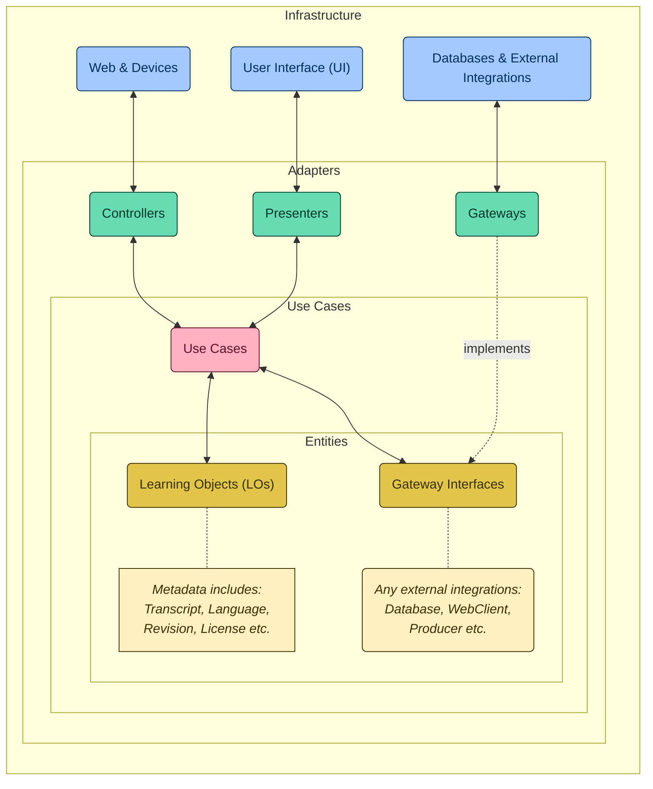

# Accessibility (A11y) in Clean RESTful APIs

Discover how to combine the concepts of Clean Architecture with the Speech-To-Text (STT) concept to promote accessibility for audible educational content and harness the power of Java, Spring Boot, and MongoDB in building a RESTful API focused on accurate audio transcription.

Presentation slides available here: [DIO Acceleration: Accessibility in Clean RESTful APIs](https://bit.ly/DIO-11-25)

## Hands-On Overview

The Audio2Text project is an advanced system designed to transcribe audio content into text format, leveraging the power of OpenAI's API for high-quality transcriptions. The project follows Clean Architecture principles to ensure a scalable, maintainable, and well-organized codebase.

## Project Structure and References

This project's architecture is inspired by and references several key sources in Clean Architecture and software design. The structure is visualized using a mermaid graph for clarity.

### Key References and Inspirations:

- **[Speech2Learning](https://github.com/falvojr/speech2learning)**: PhD project by [@falvojr](https://github.com/falvojr), which explores speech-to-text services to improve the accessibility of learning objects.
- **[The Clean Architecture Blog Post](https://blog.cleancoder.com/uncle-bob/2012/08/13/the-clean-architecture.html)**: Robert C. Martin's (Uncle Bob) seminal post on Clean Architecture principles.
- **[Clean Architecture for Spring Application](https://github.com/LuanPSantos/Clean-Architecture-For-Spring-Application)**: A comprehensive guide by LuanPSantos on implementing Clean Architecture in Spring applications.

## Development Demands (TODOs)

Our development team has outlined several key TODOs for further implementation and integration:

### Environment Setup

`TODO 1. Check/Create the mandatory environment variables!`
> Code built hands-on:
> https://github.com/digitalinnovationone/acceleration-a11y-clean-restful-apis/blob/adf20251609ed728f7379883492e280fe5aa58e3/src/main/resources/application.yml#L1

### Integration with OpenAI API to High-Quality Transcription

OpenAI API Reference: https://platform.openai.com/docs/api-reference/audio/createTranscription

`TODO 2. Respecting the TranscriptionService contract, consumes POST "audio/transcription" on OpenAI API!`
> Code built hands-on:
> https://github.com/digitalinnovationone/acceleration-a11y-clean-restful-apis/blob/56c773e20fe899f9a54eb9e0dfa55d5e4f4a577a/src/main/java/com/falvojr/audio2text/domain/transcribedaudio/adapter/gateway/TranscriptionServiceImpl.java#L46

`TODO 3. Orchestrate the integration with transcription service.`
> Code built hands-on:
> https://github.com/digitalinnovationone/acceleration-a11y-clean-restful-apis/blob/a826c1e7ebf9dc41d390e601ec1ef93e8f7ca485/src/main/java/com/falvojr/audio2text/domain/transcribedaudio/usecase/CreateTranscribedAudioUC.java#L38

## Accessibility Showcase

VLibras Widget Reference: https://vlibras.gov.br/doc/widget/installation/webpageintegration.html

`TODO4. Using the JavaScript Fetch API, consumes GET "/transcribed-audios/{id}" locally and show the transcript.`
> Code built hands-on:
> https://github.com/digitalinnovationone/acceleration-a11y-clean-restful-apis/blob/fd9f73cae6501832cc0d5048f16e36dc199fe2c1/src/main/resources/static/libras.html#L24

`TODO 5. Integrate with VLibras: https://vlibras.gov.br/doc/widget`
> Code built hands-on:
> https://github.com/digitalinnovationone/acceleration-a11y-clean-restful-apis/blob/fd9f73cae6501832cc0d5048f16e36dc199fe2c1/src/main/resources/static/libras.html#L43
