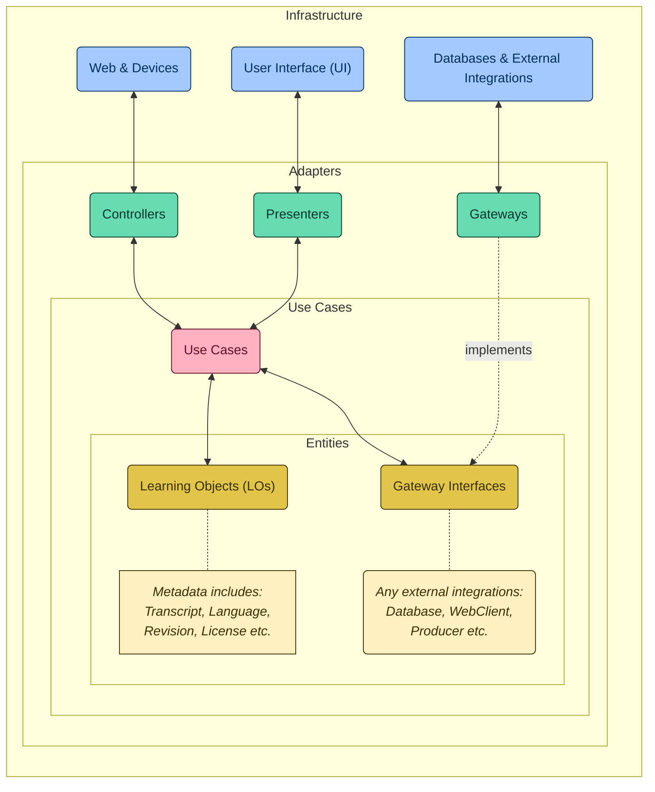

# DIO Acceleration: Accessibility (A11y) in Clean RESTful APIs

## Overview

The Audio2Text project is an advanced system designed to transcribe audio content into text format, leveraging the power of OpenAI's API for high-quality transcriptions. The project follows Clean Architecture principles to ensure a scalable, maintainable, and well-organized codebase.

## Project Structure and References

This project's architecture is inspired by and references several key sources in Clean Architecture and software design. The structure is visualized using a mermaid graph for clarity.

### Key References and Inspirations:

- **[Speech2Learning](https://github.com/falvojr/speech2learning)**: PhD project by [@falvojr](https://github.com/falvojr), which explores speech-to-text services to improve the accessibility of learning objects.
- **[The Clean Architecture Blog Post](https://blog.cleancoder.com/uncle-bob/2012/08/13/the-clean-architecture.html)**: Robert C. Martin's (Uncle Bob) seminal post on Clean Architecture principles.
- **[Clean Architecture for Spring Application](https://github.com/LuanPSantos/Clean-Architecture-For-Spring-Application)**: A comprehensive guide by LuanPSantos on implementing Clean Architecture in Spring applications.

## Development Demands (TODOs)

Our development team has outlined several key TODOs for further implementation and integration:

### Environment Setup

`TODO 1: Verify and set up the necessary environment variables for the project operation.`

### Integration with OpenAI API to High-Quality Transcription

`TODO 2: Implement the TranscriptionService contract to consume the "audio/transcription" endpoint of the OpenAI API.`

`TODO 3: Orchestrate the integration of the transcription service within the application flow.`

## Accessibility Showcase:

`TODO 4: Use JavaScript Fetch API to consume the "/transcribed-audios/{id}" endpoint and display the transcript in the front-end.`

`TODO 5: Integrate with VLibras to provide accessibility support for Brazilian Sign Language translation.`
